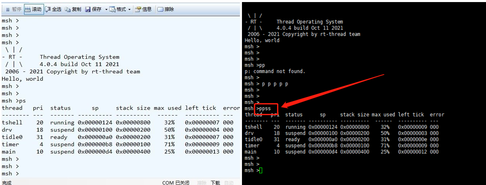

# bluetrum_sdk

# 注意事项

使用 master 的内核的话，BSP 要使用 1.0.9 之后的版本

**中断的问题**

中断需要设置到 ram 的段中，比如

```c
RT_SECTION(".irq.example.str")
static const char example_info[] = "example 0x%x";

RT_SECTION(".irq.example")
void example_isr(void)
{
    rt_kprintf(example_info, 11);
    ...
}
```

**链接文件的问题**

编译时提示某个段不够大的时候，需要自行修改段的大小

https://ab32vg1-example.readthedocs.io/zh/latest/rt-thread/link_file.html

想要更进一步了解链接文件的话可以看看下面的链接

https://home.cs.colorado.edu/~main/cs1300/doc/gnu/ld_3.html

**scons 编译问题**

SDK 依赖的库在软件包中，需要 pkgs --update

**RTC**

RTC 编译报错的话需要更新内核

**串口**

串口0暂时无法通过 pb2 打印

串口0默认使用的是单线串口，也就是 tx rx 一条线，单线串口在终端调试需要使用 downloader，在 downloader 里面就不会有回显


